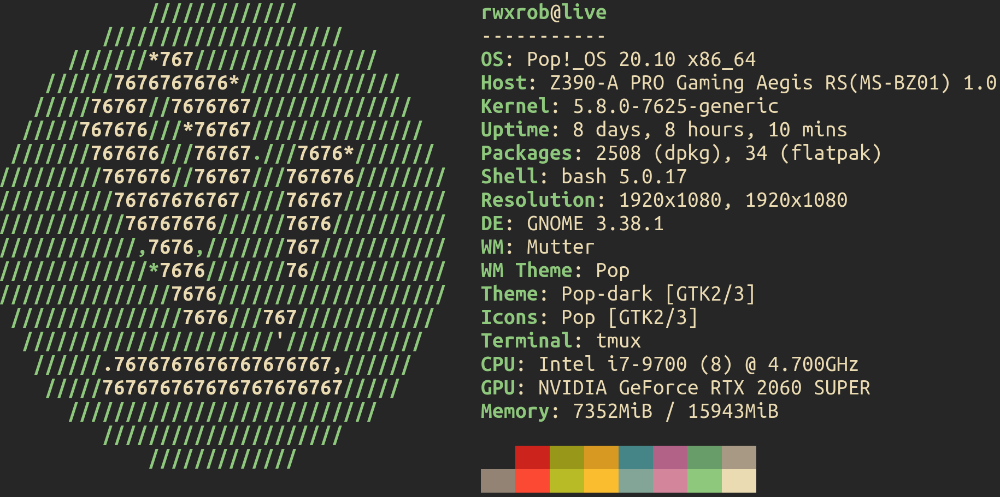

# Frequently Answered Questions

You ask. I answer, usually.

## Do you do code reviews?

No. Not unless I am mentoring you. That said, you can still ask in the
chat during the weekly semi-live mentoring and someone might be able to
help. Perhaps I have a moment between sessions. You can also ask in the
Discord.

However, you really need to learn how to do your own code reviews and
feel confident about them by identifying people and projects you (and
others) consider reliable and emulating what they do. Eventually, you'll
get a feel for when your code looks like it would be right at home
within one or those professional projects. Boom, you reviewed your own
code.

Pair programming with a mentor or senior developer is also one of the
best ways to get immediate feedback on your code quality. Many senior
developers started out that way.

## What are your specs? What's your rig?



## What keyboard do you use?

Whatever I damn well feel like! ;)

I'm so tired of being judged by my keyboard selection. So I'm
telling you that now before I tell you.

Let's start by considering who actually has the greatest need for
maximum typing speed in the world. Here's a hint. It ain't coders and
gamers. Yeah, it's writers.

So what keyboards do writers use?

Here's another hint. It doesn't glow with LED hues and make
enough noise to drive any normal person to a level of insanity calling
them from inside to track you down and beat you to a bloody pulp with
the damn thing. (I fucking HATE keyboard noise.)

Ding, ding, ding! You guessed it. 

The now "classic" 52-key (yes I use ever one of those number pad keys)
chicklet keyboard from, wait for it, Apple Computer Company. I own about
16 of them (left over from a school I ran).

I know. I know. I *despise* Apple.

But there is simply no keyboard more silent, more ergonomic, and faster
for most regular typing demands than this beautifully ugly aluminum
white thing. In fact, it is the only white colored thing within three
feet anything at my workstation (which I admittedly hate, but cannot find
a "dark mode" equivalent in any knock off I've tried).

The modern keyboard from Apple prompted a class action lawsuit. They are
horrible, loud and prone to utter destruction from the smallest bit of
corn chip. I know, I have a shitty Macbook Pro that I would love to
unload but can't now because this. Thank God it still
has an escape key though.

But really that shouldn't matter.

Speaking of escape keys. I map mine to CapsLock these days in the OS as
soon as I attach it to anything I plan to use regularly.

There. Laugh all you want, gamers. My keyboard of choice is a Mac. (108
is my top on Nitrotype, btw). If you actually care about your hands, you
will get off those noise, beastly mechanical keyboards as soon as
possible. I predict a wave of all kinds of ergonomic, chronic conditions
in about 20 years. We already tried these, people. That's where the low
profile came from. But none of y'all remember so you are making the same
mistake we made in the 80s that led to the slim keyboards of the
90s. I know because I personally knew people who had to wear a brace
constantly just from using their horrible IBM keyboards.

But y'all are gonna do what you want anyway. You have been warned.

Oh yeah, split keyboards are useless pieces of wacky shit that appeal to
a certain type of person who also is inclined to wear five-finger shoes
(a great quote from @green_jenny ).

Oh wait, there actually may be
[evidence](https://www.researchgate.net/publication/23157799_The_Split_Keyboard_An_Ergonomics_Success_Story)
to the contrary! Looks like split keyboards might be better. I maintain
my hypothesis that low profile, low travel keyboards reduce the muscle
strain that was the major cause of those studies. None of them includes
studies with low-profile keyboards. Only the shitty mechanical ones. And
yeah, I agree, a split keyboard beast like that would obviously be
better given the travel and muscles required to activate the keys. Not
so with a low-profile, low-travel, writer-preferred Apple keyboard)

## What are you using for chat? Why not Twitch/YouTube?

[chat.rwx.gg](chat) is `##rwx.gg` (for now, soon to be `#rwx.gg`) on
IRC freenode.net.

IRC is superior to Twitch and YouTube for many reasons. In fact, all
Twitch chat *is* IRC under the hood:

* Not controlled by any corporation
* Reliable chat provider that won't go away
* Works even when logged out
* Maintains chat history
* Zero chat lag
* Well established community
* Tons of *different* tools to pick from
* Completely safe when used properly
* Opens up access to wider IRC community
* Emphasizes communication over spamming

YouTube provides the *essential* ability to create chapters and
bookmarks that are labelled and easily used by viewers. YouTube also
provides wider access, full transcoding, and a far superior API for all
things (except live chat which sucks).

You can watch my [full video
rant](https://www.youtube.com/c/rwxrob/search?query=twitch) against
Twitch if you prefer.

## Wait, why aren't you talking or on video?

These days (now that I've decided to do everything on *the* YouTube with
monetization) it's hard to *not* find me without my camera on.
Apparently, people like to see people in videos. Who would have guessed?
In the past I've had other sorts of modes:

* ***Work Mode.*** When I really just need to get stuff done and not
  really pay attention to the chat other than just as a fun diversion as
  if I had people working in the office next to me. In this mode I'm
  more inclined to just listen to ambient sounds and chill music and not
  even notice questions let alone answer the obvious ones. I code best
  with chill music (as opposed to death metal or, oh my god, techno).

* ***Voice Mode.*** When I'm wanting to discuss something over chat or
  rant you will hear my voice and (sometimes) see me on video. This is
  when I'm dedicated to interacting with people on the stream. There
  will almost never be music on in this mode since it is difficult to
  hear anyone with music on over their voice and it messes up YouTube
  closed captioning.

* ***Rubber-Duck Mode.*** This is a form of *Work Mode* but involves me
  talking through a particularly hard part of the design as if talking
  to a rubber-duck (called "rubber-ducking" by those in the trade). You
  just get to listen in on it. Sometimes I will switch from *Work Mode*
  to this mode rather quickly. When I do I drop the music and turn on
  the mic and usually go right back to the music later.

## Isn't this the same web site style as [rwx.gg](http://rwx.gg)?

Why yes, yes it is. Laziness is a virtue.

## How are you doing that transparency? What's your window manager?

First of all, I use whatever window manager is on the system because I
live in the terminal. I happen to have whatever comes with PopOS. It's
the default Gnome desktop manager, I think.

* I full screen a **Gnome-Terminal** (but any terminal will work) and
  set the transparency. For me I just type F11 and it goes into full
  screen.

* I find a good **background video on YouTube** that is okay with
  copyright and loop that in full screen as well. 

* I find a good **sound effect or music YouTube video**, again with no
  copyright restrictions, and loop that as well. 

It is a little hard to manage them. But I have gotten used to managing
everything with Alt-Tab (Command-Tab for me) so I can switch between
them fast enough when needed. 

I have been really loving PopOS `Super` key window zooming so I can get
a quick look at everything in real-time even while still displaying.
This is particularly important when streaming with hotkeys for important
things like hiding your screen to do scary stuff. You can tap `Super`
just to glance at OBS to make sure the preview is what you expect before
doxing yourself.

## What font do you use on your terminal?

UbuntuMono Nerd Mono (for no particular reason). Terminal is set to 18
font size. 

## How do you reformat paragraphs like that?

I use the `gw` (cousin of `gq`) to do all my paragraph formatting
usually combined with a `}` to select up to the next blank line, but
sometimes with a `{` to select the everything above to the previous
blank line (which is *essential* for formatting Go comments that cannot
have a blank line before the actual code and the code gets mangled if
you don't).

## How do you get your keystrokes to show on the screen?

A tool called `screenkey` that has been configured for streaming out of
the way in the bottom right corner. If you do decide to use it, make
sure to learn `control+control` or whatever to disable it so that you
can reliably turn it off when entering any password or secret
information (yes even KeePassXC or cut and pastes).

## Aren't you afraid someone will see what you type with screenkey?

Nope. Because you can turn it off why holding a hot key combination
rather easily. I use both the left and right control keys. Some people
would never dare to do that. I live dangerously. 

## What editor are you using?

[Choose an Editor That's Right for You](https://youtu.be/420YRb3LVn8)

I'm a big `vi` user from before there was a `vim` so I have tried to
keep with the `vi` purity as much as possible. Recently, however, I've
realized that a lot of my favorite shortcuts and habits are actually
vimisms that crept into my regular editing sessions. So these days you
see me trying to adopt more of the things that only `vim` can do that
`vi` cannot. For example, I had not even used a `vim` macro until
October of 2020 and I've been using `vi` since 1996 or so.

## Why not NeoVim (`nvim`)?

I [hate NeoVim](https://rwx.gg/tools/editors/neovim/). It's a complete
disaster. It has made ever wrong decision possible. It is a living
testament to the reason Bram hates dealing with potential contributors
who would put all the dumb crap into Vim if allowed. All I can say
is ...

God bless Bram Moolenaar.

## Why don't you like OOP/Java/C++?

It's not that I don't like *true* OOP. I've just seen *class-based* OOP
abused so much that agree with Brian Cantrill about the "dark times" of
the 90s when it emerged. Here's another explanation:

> "The problem with object-oriented languages is they've got all this
> implicit environment that they carry around with them. You wanted a
> banana but what you got was a gorilla holding the banana and the
> entire jungle." – Joe Armstrong

First let me say that there are many principles that are associated with
OOP that are *not* in fact just OOP:

* encapsulation
* polymorphism
* separation of concerns
* interfaces

These things are well-established best practices and present in *many*
other languages with different paradigms.

But the *class-based* OOP primarily associated with Java and C++ and
SmallTalk (originally) has been overwhelmingly proven to be a broken
paradigm --- especially single inheritance models.

What really pisses me off is how totally entrenched it has become in
everything down to our AP computer science tests. The entire industry
has been plagued by the largest marketing efforts ever done for a
programming language (\$500k for Java) and we are still seeing its
massively negative affect all through the industry even today.

For those who *truly* want to understand this issue (and frankly most
who ask me the question don't) then watch the following videos
completely before you *ever* breathe a word of question about this to me.
Otherwise, you are just wasting all of our fucking time.

My favorite is this [video from Jim Coplien](https://www.youtube.com/watch?v=ZrBQmIDdls4):

Jim: "Who here is has ever done any object-oriented programming?"

Crowd sheepishly raises hands.

Jim: "Okay, you there, what language to you program in?"

Scared Coder: "Java"

Jim spitting and pointing: "Java is the *only* language in which you
*cannot* write object-oriented programming code!"

Why all that? 

Because no one even knows *what the fuck* true object-oriented
programming even is. I didn't. I drank the Kool-aide in the 90s big
time. I even gave presentations at conference about Java. I coded
thousands of lines of Java, and was burned by all the negative things
that are not widely regarded as the problem. At one such conference one
of the creators of Java was asked a telling question:

"If you could change one thing about the language what would it be?"

"Inheritance, " he replied.

The crowd roared with laughter because they thought he was kidding.

He wasn't.

People throw the words related to OOP around like crazy because the
gang of three dumb asses convinced the world that things like Java and
C++ are *actually* object-oriented, but they *never* were. You cannot
even code OOP in Java. In C++ you can, but you have to break from the ++
part and more of the C part.

There are two other great video references to these problems. My
favorite is from [Brian Cantrill](https://youtu.be/HgtRAbE1nBM) but
[Brian Will's video](https://youtu.be/QM1iUe6IofM) is also *very* good,
just less comedic.

So no jungle with your banana.

## What's your vim theme?

Um, these days it is
[gruvbox](https://duck.com/lite?kd=-1&kp=-1&q=gruvbox), which is a
better take on Solarized and softer on the eyes. All of that (and more)
is in my
[`.vimrc`](https://gitlab.com/rwxrob/dotfiles/-/blob/master/common/vim/vimrc).

## Where did you get that music/background?

Everything I use is from YouTube. You can find my playlists on [my
YouTube channel](https://youtube.com/rwxrob). Most of it is copyright
free streams .

## What's Up with That `ix` Command?

The <http://ix.io> is the best terminal-centric pastebin alternative out
there. I've made a video about it as well as a [ix shell
script](https://gitlab.com/rwxrob/dotfiles/-/blob/master/scripts/ix)
that makes using it a bit easier and writes to the clipboard with
`xclip`.

## What's your hardware/software setup?

Here's my hardware and software applications that I rely on:

* PopOS!
    * Gets out of the way so I can get stuff done
    * No desire to futz with OS, been there, done that
    * Rock solid
    * It just works
    * `apt`
* Gnome-Terminal
    * Alacritty proved too buggy, but otherwise was nice
* Bash Shell
    * Universal, powerful
    * Tab completion
    * `$CDPATH`
    * Exported functions
* TMUX 
    * Configured for `screen` finger-memory
    * Nested TMUX session
        * Two different sockets
    * Main session 
* Vim
    * Neovim is buggy and unnecessary
    * Prefer TMUX for panes to Vim panes
    * Best-in-class macros and shell integration
    * Blows the doors off VSCode for *most* things
    * Ubiquitous unlike Emacs
* WeeChat IRC to Twitch (not WeChat)
    * FIFO for comms.

## How do you take notes like that?

I use the `note` script that combines my `kn` script with a lazy `save`
script for simple git commits. All of them (and more) are available in
my [dotfiles](https://gitlab.com/rwxrob/dotfiles) for your perusing
pleasure.

## How are you doing that Go automated test?

It's a combination of several simple shell scripts that run the test
only when an important file changes in the current directory or any
directory underneath it. You can get ideas from the following scripts in
my [dotfile directory](https://gitlab.com/rwxrob/dotfiles):

* [got](https://gitlab.com/rwxrob/dotfiles/-/blob/master/scripts/got)
* [gott](https://gitlab.com/rwxrob/dotfiles/-/blob/master/scripts/gott)
* [onchange](https://gitlab.com/rwxrob/dotfiles/-/blob/master/scripts/onchange)
* [haschanged](https://gitlab.com/rwxrob/dotfiles/-/blob/master/scripts/haschanged)
* [changed](https://gitlab.com/rwxrob/dotfiles/-/blob/master/scripts/changed)

Some have suggested I should use the internal Linux events for this, but
I prefer something based on `find` that works anywhere Bash, or even
POSIX shell is installed (which would need some tweaking). 

## How are you searching and browsing from your terminal?

It's really just a combination of Lynx and Bash shell scripts, sometimes
a little `curl` in there. Here are the links to the relevant files:

* [duck](https://gitlab.com/rwxrob/dotfiles/-/blob/master/scripts/duck)
* [google](https://gitlab.com/rwxrob/dotfiles/-/blob/master/scripts/google)
* [bing](https://gitlab.com/rwxrob/dotfiles/-/blob/master/scripts/bing)

Then I just add the following aliases:

```sh
alias '?'=duck
alias '??'=google
alias '???'=bing
```

Plus there are some videos on it I made a long time ago:

* [Lynx Text Web Browser FTW!](https://youtu.be/Vdd2MTv6vrs)

## Why `lynx` and not `w3m`?

Because `lynx` is simply superior:

* Better `vi` bindings
* Faster since not downloading and positioning images (just stupid)
* Older and better supported
* Has its own mailing list

But the *single* biggest advantage of Lynx is that it *keeps a
consistent text flow on the screen*. I cannot overstate how important
this subtle difference is. You won't notice it until you have logged
thousands of hours using it. But once you have you will find your eyes
jumping and scanning much more efficiently over web pages in text form
from Lynx than you ever could in `w3m`. This scanning ability is the
*entire reason* for using a text based browser in the first place. I can
search for full documentation on anything that an "intellisense" pop-up
would tease you with in less time than it takes for the fucking pop-up
to stop annoying you in your dumb-ass intellisense-enabled IDE. Very few
people on planet Earth (including most inexperienced YouTubers with big
mouths) will appreciate that difference, but I promise you, those that
do *destroy* the research efficiency of the others.

## Do you have a Discord? How can I message you?

[Yes.](https://discord.com/invite/9wydZXY) And you can just DM me there.

## How are you streaming and chatting like that?

It's a combination of things:

* WeeChat IRC client connected to Twitch in a nested TMUX pane so it
  stays even when I create a new window.

* Streaming <https://restream.io> with the bot enabled to messages
  appear to and from Twitch, YouTube, Periscope/Twitter, Discord and
  eventually LinkedIn (I hope). 

* OBS Studio (of course) which installed and worked without any problems
  or driver tweaking whatsoever on my PopOS distro.

* The
  [screenkey](https://gitlab.com/rwxrob/dotfiles/-/blob/master/scripts/screenkey)
  tool positioned down in the corner displaying what I type.

:::co-rant
I had to *write an email* to have my Twitch Affiliate status removed in
order to be compliant with their shitty terms of service that says you
have to wait 24 hours to put content on anything else. Then my subs
couldn't even unsub because the removed the button. Fuck that shit.
Twitch can bite me. They are *lucky* to have my content. Fuckers. It's
clear where their priorities are: selling out for the quickest buck, not
improving the world through education and engineering streams. Yeah,
I've come to really fucking hate Twitch (as a company) even though I've
met a lot of people through it.
:::

* Restream.io (currently,
although I am working on removing dependency on that bot because it is
just ugly).

## How do you get that large figlet font on terminal?

All the fonts that I use are in a [separate
repo](https://gitlab.com/rwxrob/fonts). The figlet fonts I've collected
over the years are all under `figlet`. I just combine the `figlet` and
`lolcat` command to get the result you see in these scripts:

* [figl](https://gitlab.com/rwxrob/dotfiles/-/blob/master/scripts/figl)
* [back](https://gitlab.com/rwxrob/dotfiles/-/blob/master/scripts/back)

The main figlet font I use is `future`.
