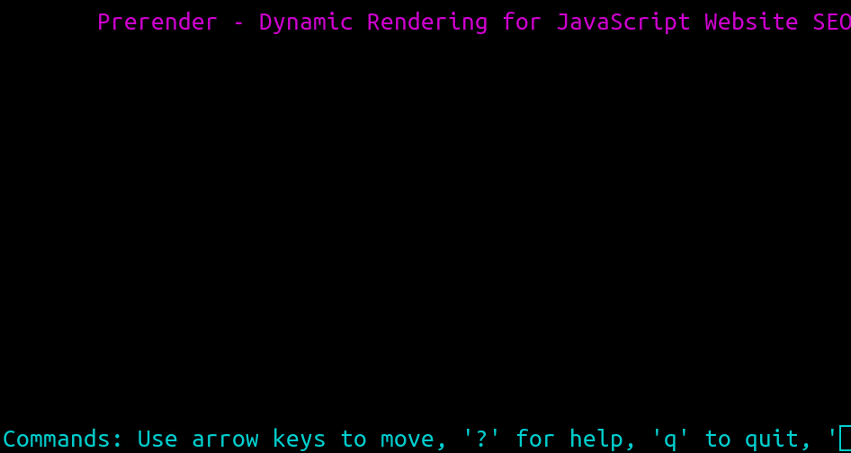

One of the main reasons I have a personal site it to bring attention to the unimaginable, inexcusable shit I run across on a regular basis. 

I obviously make no apologies for the ranting and language. After all
this is a *personal* site and personally I think strong opinions are a
good thing when backed with objective research and given up easily when
presented with new contradictory data, you know, like science does.

Unfortunately, sometimes the only thing some people respond to is total
and complete shame and believe me these people deserve it. John Oliver
would agree. But in all honestly calling this shit out just makes me
feel better so I can move on to other things. "Don't get mad. Get busy,"
I always say.

## Shitty Web Sites That Depend on JavaScript

There are a *lots* of very legitimate, non-stupid reasons that you
should care about how the Web is currently being destroyed. Enabling
JavaScript and even using a graphic web browser these days can be
completely and totally inefficient, insecure, and downright stupid.
Turning off JavaScript isn't just for weirdos and ultra-geeks. It's for
*anyone* who cares about their personal security and privacy. *An entire
bugbounty industry is thriving because of shitty JavaScript-enabled
sites.* 

Don't believe me? 

Well have you filled out a form *ever* and saved it? Lucky for you
JavaScript allows *anything* you ever typed into those forms to be
stolen by *anyone with a web site and JavaScript enabled*. Yeah, it
really is that bad. If you ask nice I'll show you how to completely own
CodeCombat.com and get *everything for free legally without paying a
dime* because of the *horrible* JavaScript that site depends on. Shall I
go on?

Most of these morons who make this shit don't even know how fucking
stupid they are. They finished some shitty bootcamp in eight weeks and
are now seriously breaking the Web while blaming everyone who doesn't
use JavaScript. 

These people are so fucking stupid they have even created
*documentation* sites that are fully and completely dependent on
JavaScript to render, which will never be available from Google SEO or
any web archiver. 

Please God, *please* let natural selection kick in! Here let me help it
along by helping *other* people know about them. Perhaps I'll have the
good fortune of having these developers actually find this shit list.
But we all know they just won't care. They've already been paid.

### 💩 [Browser.org](http://lynx.browser.org/)

Uh, yeah. 404.

### 💩 [Prerender.io](https://prerender.io)

This piece of shit company is actually *actively* campaigning to destroy
the text-based Web by promoting the use of JavaScript for documentation
sites and ensuring they are "SEO" safe. The entire premise of SEO is
ass-backwards but besides that the fact that this pig-shit company does
not even consider what becomes of those who cannot use a JavaScript site
says everything you need to know about them. The fact that they *claim*
Google supports them and that Meteor and Lyft uses them is beyond enough
evidence of how *fucking* stupid they are. Here's what their site looks
like to a blind person or someone using a text-based browser:



I take solace in the fact that *anyone* stupid enough to actually pay
these morons a dime for their "service" deserves what they get. And
frankly, I'm glad they made themselves known.

### 💩 [BountySource](https://www.bountysource.com/issues/2397491-ircv3-support)

This is actually a site about IRC support of all things that requires
fucking JavaScript. How completely and totally fucking stupid do you
have to be to realize that IRC was originally and continues to be a
terminal application. These morons get all five shit emojis. Someone bag
them, light them on fire, and leave them on their broke-ass step.

### 💩 [NewsGroupReviews](https://www.newsgroupreviews.com/newsgroup-readers.html)

This piece of shit site actually claims to have the best reviews of UUCP
newsreaders without even supporting a text browser such as link and
*requiring* JavaScript to even render the fucking page. 

```html

<-- This site is optimized with the Yoast SEO plugin v13.2 - https://yoast.com/wordpress/plugins/seo/ -->

```

Yeah, not only unreadable, they are stupid enough to actually choose to
use Word fucking Press for it. You will likely have to work hard to
resist the violent urge to hack this shit and take it completely off the
Internet.

### 💩 [Sunlight Media](https://sunlightmedia.org)

Shit always smells better when under the sun. I stumbled upon this
heaping pile of 403 Forbidden nginx error while researching Bash v.s.
Zsh. (Of course you can guess what shell they prefer.) Here's a hint.
Their "services" include (and I'm not making this up):

* WordPress (most hackable web platform on planet Earth)
* E-Commerce (does anyone say that word anymore?)
* Mobile Apps ("What's a service worker?")
* Logo Design (of course)
* Joomla Design (had to add "Joolma" to my dict)
* Flash (what the actual fuck?!)

Kinda makes a guy not want to read *any* thing else these people have to
say. (See how I said "people" and not "morons". I am improving.)

### 💩 [DevOps.com](https://devops.com)

Nothing says I'm a dumb ass more than having the mantra "Where the World
Meets Developers" on your site full of articles and documentation that
cannot be accessed by a text browser or fetched with curl (or indexed
for that matter). It's no surprise that the idiots behind DevOps.com not
only cannot adequately draw the distinction between DevOps and being an
SRE but that their "developers" are stupid enough to build their entire
web site on WordPress. 

God it takes everything in me from hacking the shit out of them. Such
hubris and cluelessness must not go unpunished. This content is
objectively bad for humanity.

I mean seriously who actually says things like "where the world meets
developers"? What pointy-haired moron came up with that one. At least
true engineers will see all the red flags and know to steer far, far
away from anything they have to say. Darwin's law in action.

